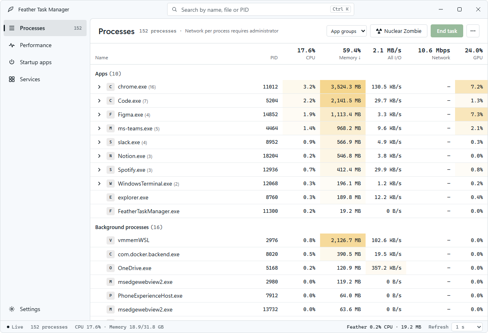
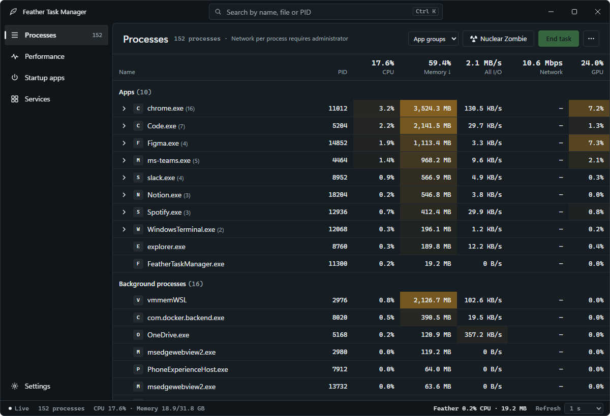
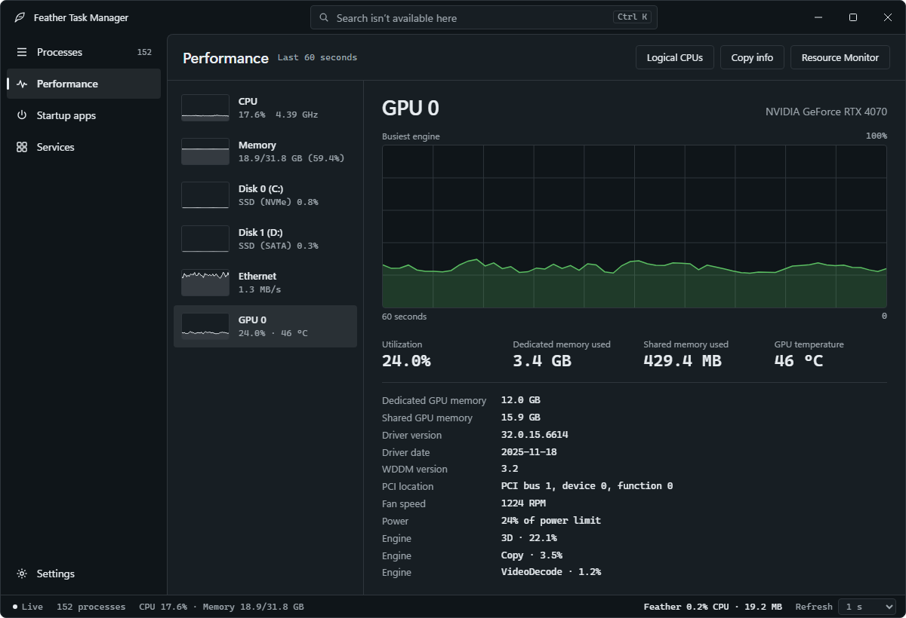
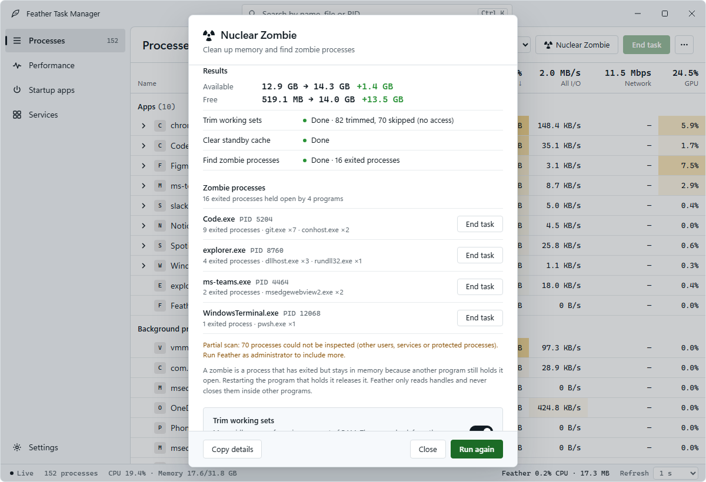
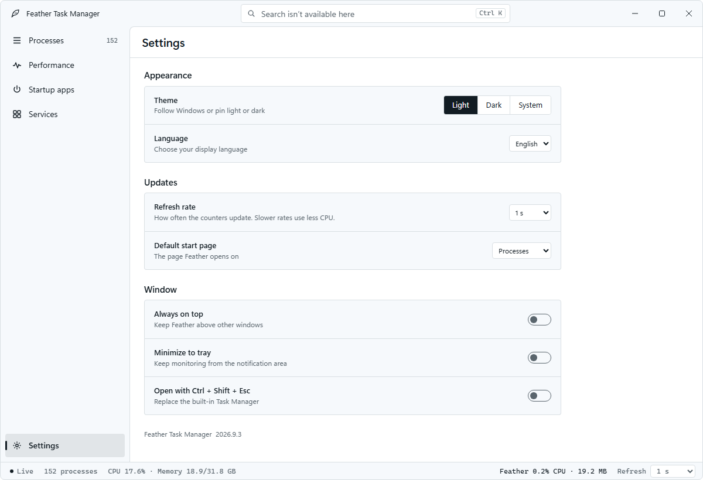

<p align="center"></p>

# Feather Task Manager

[English](README.md) · **한국어** · [다운로드](https://github.com/Hardt-LLC/FeatherTaskManager/releases/latest)

가볍고 빠른 Windows 작업 관리자. Rust와 Win32로 만든 네이티브 앱입니다.

<p align="center"></p>

## 미리보기

| 어두운 테마 | 성능 |
| --- | --- |
|  |  |
| **Nuclear Zombie** | **설정** |
|  |  |

미리보기는 앱과 같은 모습의 [인터랙티브 디자인 프로토타입](design/reference/feather-task-manager.html)(시뮬레이션 데이터를 쓰는 HTML 파일 하나)에서 캡처했습니다. 파일을 내려받아 브라우저로 열면 모든 화면, 밝은/어두운 테마, 정렬, 오른쪽 클릭 메뉴, 명령 팔레트(`Ctrl+K`), Nuclear Zombie 실행을 직접 볼 수 있습니다.

## 장점

- **가벼운 실행** — 브라우저 엔진 없이 동작하며, 별도 런타임 설치가 필요 없습니다. 최소화하면 수집을 멈추고, 애니메이션은 움직이는 동안에만 동작합니다.
- **기본 컨트롤이 아닌 디자인** — 로고·검색·창 버튼을 하나로 합친 제목 표시줄(스냅 레이아웃 지원), 직접 그린 표·메뉴·대화 상자, 픽셀 단위 부드러운 스크롤, 밝은/어두운 테마를 제공합니다.
- **편리한 프로세스 관리** — 앱 그룹·목록·트리 전환, 실시간 그래프, 효율 모드, 개별·트리 종료를 지원합니다.
- **시스템 상태를 한눈에** — CPU 코어·메모리·디스크·네트워크·GPU별 성능과 모델명, GPU 온도, 메모리 속도·슬롯, 시작 앱 토글, 서비스 시작·중지·재시작을 제공합니다.
- **Nuclear Zombie** — 오래 켜 둔 PC의 메모리를 앱을 끄지 않고 정리하고(작업 집합 정리, 관리자 승인 후 대기 캐시 비우기), 다른 프로그램이 붙잡고 있는 좀비 프로세스를 찾습니다.
- **한국어·영어 지원** — 언어·라이트/다크 테마를 설정하고, 명령 검색과 트레이 최소화를 사용할 수 있습니다.
- **서명된 배포 파일** — 실행 파일과 설치 프로그램에 Azure Artifact Signing의 HARDT 서명을 적용했습니다.

## 설치 및 사용법

**Windows 10 1607 이상 / Windows 11 x64**에서 사용할 수 있습니다. [최신 릴리스](https://github.com/Hardt-LLC/FeatherTaskManager/releases/latest)에서 원하는 파일을 받으세요.

| 파일 | 용도 |
| --- | --- |
| `Setup-x64.exe` | 설치 후 시작 메뉴에서 실행 |
| `Portable-x64.exe` | 설치 없이 바로 실행 |
| `Portable-x64.zip` | 포터블 앱, 설명서, 복구 스크립트 묶음 |

- **프로세스** 화면에서 앱 그룹·목록·트리 보기를 선택하고, 작업을 선택해 개별 또는 트리 전체를 종료합니다.
- **성능 · 시작 앱 · 서비스** 탭에서 시스템 상태와 실행 항목을 관리합니다.
- **성능 → 리소스 모니터**는 내장 네이티브 창을 엽니다. 5개 탭, 공통 프로세스 필터, 메모리 상세, 모듈·연결·수신 포트를 조회할 수 있습니다. 파일·연결 상세 추적은 기본 꺼짐입니다. [수집 비용과 측정 범위](RESOURCE_MONITOR.md)를 참고하세요.
- **설정**에서 언어, 테마, 갱신 주기, 시작 화면과 창 동작을 변경합니다.
- 프로세스의 **⋯ → 실시간 그래프 표시/숨김**으로 CPU·메모리·전체 I/O 추이를 확인합니다.
- **프로세스 → Nuclear Zombie**(또는 `Ctrl+K` → "메모리")로 메모리를 정리하고 좀비 프로세스를 확인합니다. 효율 모드는 **⋯** 메뉴와 오른쪽 클릭 메뉴에 있습니다.
- 프로세스의 **⋯ / 우클릭 메뉴 → 파일 속성**, **서비스로 이동**을 사용할 수 있습니다. 서비스의 **프로세스로 이동**은 현재 실행 호스트를 선택합니다. `pid:1234`로 정확한 PID를 검색하고, 검색어를 지우면 전체 목록으로 돌아옵니다.
- `—`는 미측정 값입니다. 프로세스별 GPU는 Windows 작업 관리자와 같은 규칙(가장 바쁜 엔진)으로 측정하고, 프로세스별 네트워크는 관리자 권한으로 실행할 때만 측정합니다. 시작 영향도와 CPU 패키지 온도는 측정하지 않습니다. 성능 화면은 펌웨어가 제공하는 ACPI 열 영역 온도를 센서 이름으로 표시합니다. CPU 온도로 간주하지 않으며, 센서가 없으면 사용 불가로 표시합니다. 5초마다 읽고 사용 불가일 때는 60초 뒤 재확인하며, 드라이버를 설치하지 않습니다.
- **설정 → 항상 관리자 권한으로 실행**을 켜면 매번 관리자 권한으로 시작합니다(프로세스별 네트워크, 전체 좀비 검사). 설치된 Feather에만 적용되며, 시작할 때마다(관리자 창이 열려 있어도 `Ctrl+Shift+Esc`를 누를 때마다) Windows UAC 확인 창이 나타나고, 거부하면 일반 권한으로 계속 실행합니다. 포터블 복사본은 자동으로 상승하지 않습니다. 실행 중인 복사본을 한 번만 전환하려면 **프로세스 → ⋯ → 관리자로 실행**을 사용하세요.

| 단축키 | 동작 |
| --- | --- |
| `Ctrl+1…4` | 화면 이동 |
| `Ctrl+F` | 검색 |
| `Ctrl+K` | 명령·프로세스 검색 |
| `F5` | 새로고침 |
| `Space` | 갱신 일시정지·재개 |
| `Delete` / `Shift+Delete` | 선택한 프로세스 / 프로세스 트리 종료 확인 |

**Windows 작업 관리자 대체:** Setup으로 먼저 설치한 뒤, 설정에서 **Windows 작업 관리자 대체**를 켜고 UAC를 승인하세요. 이후 `Ctrl+Shift+Esc`나 `Ctrl+Alt+Delete → 작업 관리자`로 Feather를 실행할 수 있습니다. 같은 설정을 끄면 기본 작업 관리자로 복원합니다. 설치된 파일을 수동 삭제하기 전에는 먼저 연결을 복원하세요.

업데이트·제거 전에는 Feather 창을 모두 닫으세요. 자세한 내용은 [설치 안내](INSTALLER.md)와 [기능 안내](FEATURES-v2.md)를 참고하세요.

## 소스에서 빌드

Windows에서 Rust의 `x86_64-pc-windows-msvc` 도구 모음, Visual Studio C++ Build Tools, Windows SDK가 필요합니다.

```powershell
git clone https://github.com/Hardt-LLC/FeatherTaskManager.git
cd FeatherTaskManager
cargo build --release --locked
```

실행 파일은 `target\release\FeatherTaskManager.exe`에 생성됩니다. 설치 파일 제작과 코드 서명은 [배포 안내](SIGNING.md)를 참고하세요.

## 라이선스

[MIT License](LICENSE). 사용한 라이브러리의 고지는 [THIRD_PARTY_NOTICES.txt](THIRD_PARTY_NOTICES.txt)와 [RUST_LIBRARY_NOTICES.html](RUST_LIBRARY_NOTICES.html)에 있습니다. Feather는 개인정보를 수집하지 않습니다([개인정보 처리방침](PRIVACY.md)). 보안 문제는 [SECURITY.md](SECURITY.md)의 방법으로 비공개 제보해 주세요.
